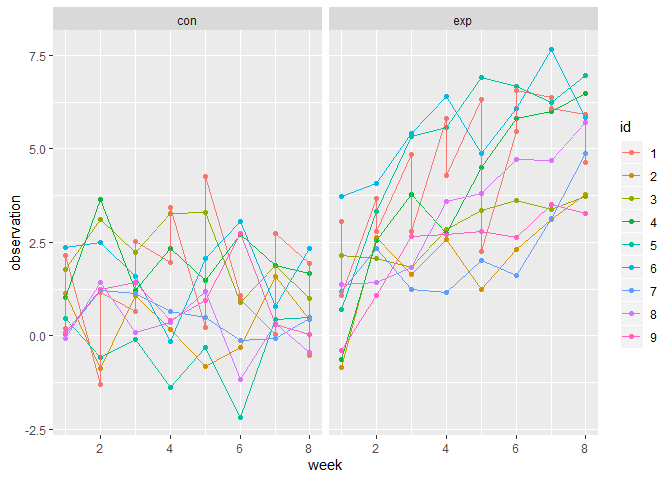
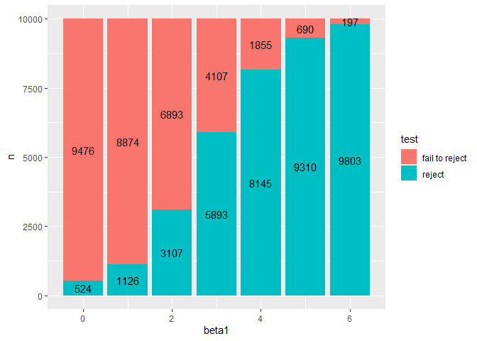
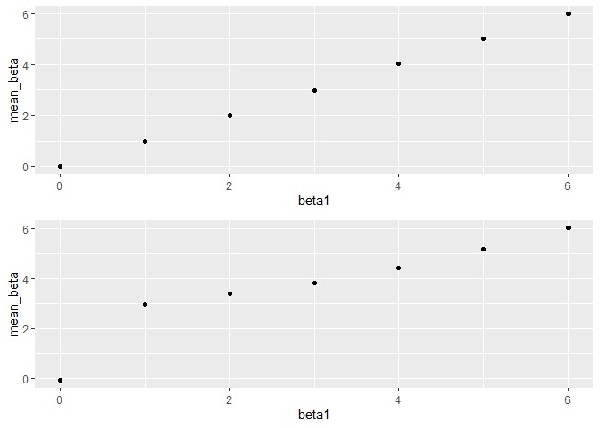

p8105\_hw5\_dw2903
================
Di Wu dw2903
2019/11/11

## Problem 1

build up function

``` r
f1 = function(x){
  if (is.numeric(x)){
    replace_na(x,mean(x,na.rm = TRUE))
  }else if (is.character(x)){
    replace_na(x,"virginica")
  }
}
```

mapping

``` r
iris_without_missing = map_df(iris_with_missing,f1)
```

## Problem 2

Tidy data

``` r
data_list=list.files("./data",full.names = TRUE)
data_list_name=list.files("./data")
data_2=map_df(data_list,read.csv) %>%
  mutate(
    name = data_list_name
    )%>%
  separate(name, into = c("group","id"),sep=3) %>%
  mutate(
    id = str_remove_all(id,"[_0.csv]"),
    id = as.factor(id),
    group = as.character(group)
  )%>%
  select(group, id, everything()) %>%
  pivot_longer(
    week_1:week_8,
    names_to = "week",
    names_prefix = "week_",
    values_to = "observation"
  ) %>%
  mutate(
    week = as.numeric(week)
  )
```

``` r
data_2 %>%
  ggplot(aes(x=week,y=observation,color=id))+geom_point()+geom_line()+ facet_grid(~group)
```

<!-- -->

Compared the control group with experimental group, control group kept
general consistant throughout 8 weeks of observation while experimental
group tended to increased as time increased.

## Problem 3

creat function

``` r
sim_regression = function(beta_1) {
  sim_data=tibble(
    x =rnorm(30, mean=0,sd=1),
    e =rnorm(30, mean=0,sd=sqrt(50)),
    y=2+beta_1*x+e,
  )
  fit=broom::tidy(lm(y~x, data=sim_data))
  tibble(
    beta1_hat = as.numeric(fit[2,2]),
    beta1_hat_p =as.numeric(fit[2,5])
  )
}
```

repeat 10000 times with test

``` r
sim_results =
  tibble(beta1 = c(0:6)) %>%
  mutate(
    output_list=map(.x=beta1,~rerun(10000,sim_regression(.x))),
    est = map(output_list,bind_rows)
    )%>%
  select(-output_list)%>%
  unnest(est)%>%
  mutate(
    test=case_when(beta1_hat_p <0.05 ~"reject",
                   beta1_hat_p >=0.05 ~"fail to reject")
  )
```

plot of power

``` r
sim_results %>%
  group_by(beta1,test)%>%
  count()%>%
  ggplot(aes(x=beta1,y=n,fill=test))+geom_bar(stat = "identity")+geom_text(aes(label=n),position = position_stack(vjust = 0.5))
```

<!-- --> as
the beta\_1 increase, the power increased as the true value is further
away from the null hypothesis.

plot of relationship of beta 1 and beta 1 hat

``` r
plot_3_2=sim_results %>%
  group_by(beta1)%>%
  summarize(mean_beta=mean(beta1_hat))%>%
  ggplot(aes(y=mean_beta,x=beta1))+geom_point()
plot_3_3=sim_results %>%
  filter(test =="reject") %>%
  group_by(beta1)%>%
  summarize(mean_beta=mean(beta1_hat))%>%
  ggplot(aes(y=mean_beta,x=beta1))+geom_point()
plot_3_2 /plot_3_3
```

<!-- --> The
mean of beta\_hat\_1 for those reject the null hypothesis is different
from the true mean of beta\_hat\_1 especially in smaller beta1 value as
beta1 getting closer to the null hypothesis, the beta\_hat\_1 reject
null hypothesis is more likely to be the outliers instead of the
majority of values.
